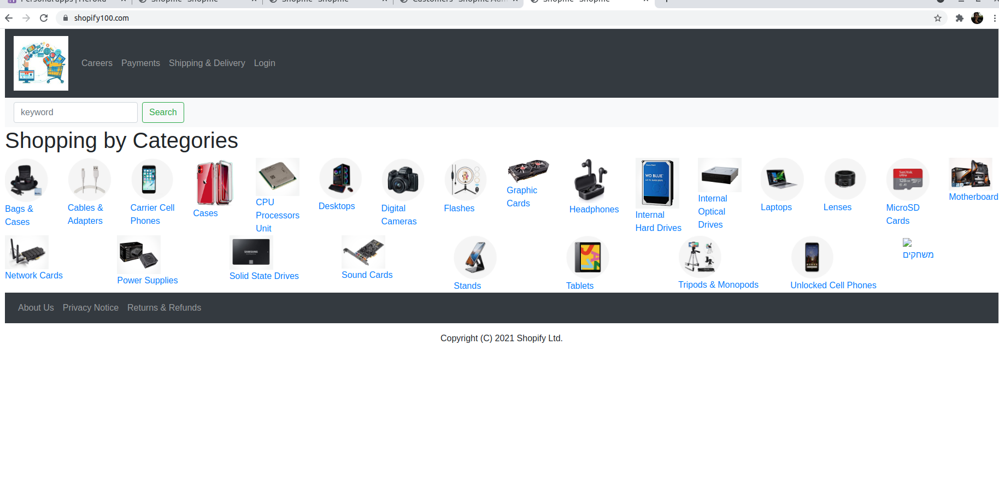
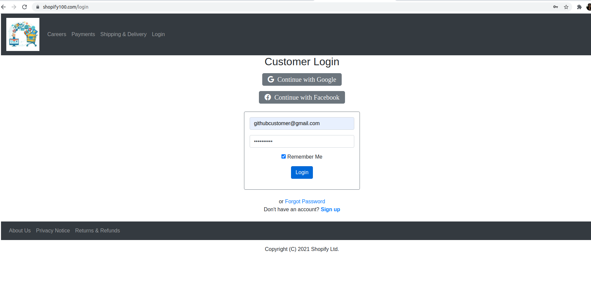
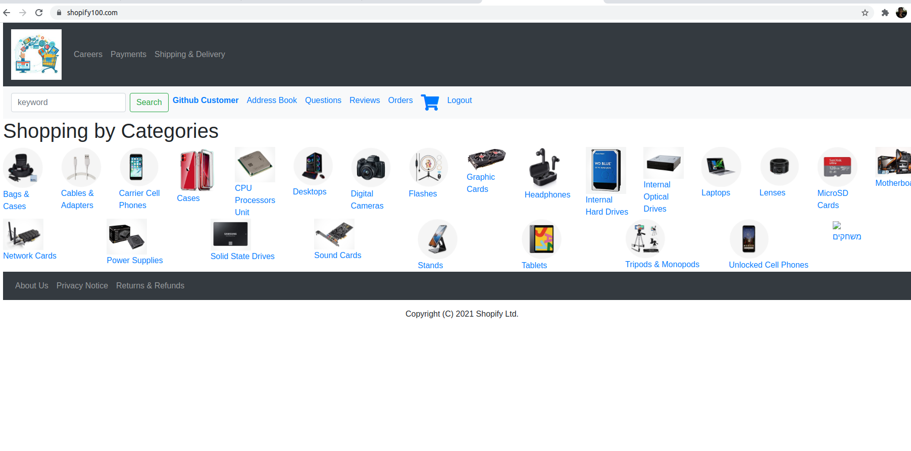
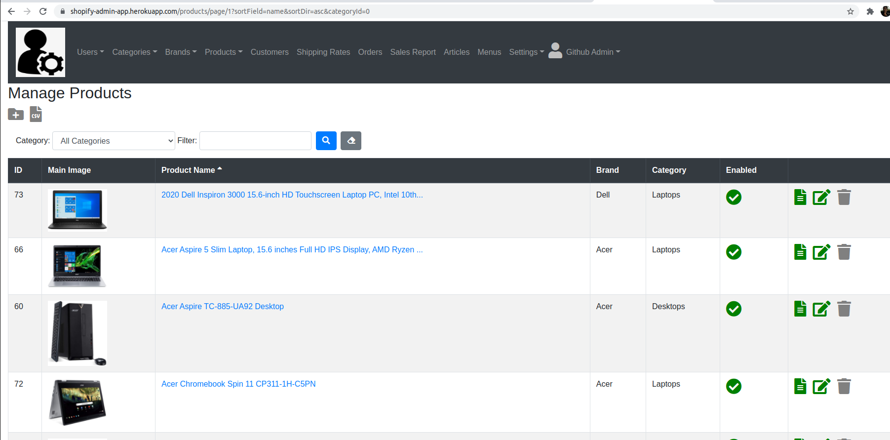

<!--
*** Thanks for checking out Spring Boot Application Template. If you have a suggestion
*** that would make this better, please fork the repo and create a pull request
*** or simply open an issue with the tag "enhancement".
*** Thanks again!


-->


# Shopify[](https://travis-ci.org/github/AnanthaRajuC/Spring-Boot-Application-Template)

    A complete Java Spring Boot Web application for an online e-shop.
    The app is used by employees and customers and provides the following key features (API):
	
•	The Employees (admin users) can perform the following operations
		Authentication and Authorization.
		Management of Employee and Customer accounts, Products, Brands, Categories, Site Settings,
		and Orders.

•	The Customers (and visitors): can perform the following operations: 
		Authentication and Authorization.
		Managing their accounts.
		Make a payment via PayPal, Credit Card or Cash.
		Tracking their orders.	

   ## Access the ShopifyFrontEnd application on Heroku

    The first screen you will see is the home page of the shopify-front-end application: 

   <center>
   
   </center>

         At this point, you are a "visitor". 
         You can login by clicking the link on the right side of the control panel-you will see the login page: 
         

   <center>
   
   </center>

         Use can use the following credentials to access the application.
         -  username: githubcustomer@gmail.com
         -  password: github2021
   
         Alternatively - You can login by using your own Google or Facebook accounts.


<b>Congradiulations!</b> You are logged in succesfully to the shopify-front-end applicatoin: You will see the home page with your user naem on the top left corner:
<center>
 
</center>

<br/>


## Access the ShopifyBackEnd application on Heroku

    The first screen you will see is login page of the shopify-back-end application: 

   <center>
   
   </center>

<br/>
<br>
Use Must have credentials of some role(Admin, Saleperson,Editor, Shipper , Assistance) in order to access the application. 
The credentials below(user name and password) will give you full access to application
        

|     Username          | Password   |     Role     |
|-----------------------|------------|--------------|
|`githubadmin@gmail.com`|`github2021`|  `Admin`     |

    
   <b>Congradiulations!</b> You are logged in succesfully to the shopify-front-end applicatoin: You will see the home page with your user name on the top left corner:

   
   <center>
   
   </center>

        
   Now follow  the URL: admin.shopify100.com to access the ShopifyBackEnd application

   The ShopifyBackEnd application is running [https://admin.shopify100.com](https://admin.shopify100.com)


   ## Features
   -  [IMPORTANT: Complete Description of the features](DOCUMENTS/Shopify-Project/shopify-user-requirements/Shopify-Website-Data-Requirements.md)
   
   ### Users: Based on the requirements of the Users(Admins,Editors,Shippers,Sales Peson, and Assistence) 
   ### The application will implement the following features:

     -  Manage admin users
     -  Manage categories
     -  Manage brands
     -  Manage products
     -  Manage admin site settings
     -  Manage categories

   ### Customers: Based on the requirements 

      Manage books
      Manage customers
      Manage reviews (but cannot write reviews)
      Manage orders (but cannot create orders)
      View statistical information


   
## Shopify Back End
   A Spring Boot Web MVC Application that exposes to the maintainers of the system a 
   fully featured website as well as REST API (Using Spring REST) that implements the following main key features to manage: 
   users, products, categories, customers, website settings, orders 
   Secured Access for various Roles in the System.
   Persist Data into a Database.

Shopify Front End: 
A Spring Boot Web MVC Application that provides the Customers/Visitors of the system a 
to perform the following key operations: 
•	Manage Accounts, Shopping Carts and 
•	Perform Payments: Using PayPal/Credit Card/Cash
	
	Key Technologies used in the projects: 
•	Java, Java Script
•	Spring Boot, Spring Security, Spring Data, Spring MVC, Spring REST, Hibernate
•	HTML, CSS, jQuery, Bootstrap, Thymeleaf
•	MySQL
•	Heroku (Deployment), AWS (S3 Service)
•	Maven
•	Third Party APIs Integrations: PayPal, Google and Face Book (OAuth2 API)


  The 2 applications are up and running on the Heroku Cloud ploatform.
  
The ShopifyBackEnd application is running [https://admin.shopify100.com](https://admin.shopify100.com)

   username: githubuser, and password: github2021
      
  
View new books, best-selling books, and most favored books on the home page
Search for books
View books listed by category
View book’s details and reviews
Write reviews for books
Order books
Check their order status and shopping history
They must register to write review and purchase books

- [User Management Module](documents/USER_MANAGEMENTS.MD):
- [User Authentication Module](documents/USER_AUTHENTICATION.MD):

- [User Profiles](documents/USER_PROFILES.MD)   
- [User Roles](documents/USER_ROLES.MD)   
- [API](documents/API.md)  
- [Internationalization (i18n)](documents/INTERNATIONALIZATION.MD) 


<!-- APPLICATION SCREENSHOTS -->
## Application screenshots

[](documents/images/app-ui/home.PNG)

**More [Screenshots](documents/SCREENSHOTS.md)**

## Details

- [Technology stack & other Open-source libraries](documents/TECHNOLOGY_STACK.MD)  
- [Technical Functionalities and To-Do](documents/TECHNICAL_FUNCTIONALITIES.MD)  
- [Getting Started](documents/GETTING_STARTED.MD)  
- [Architecture](documents/ARCHITECTURE.md) 
- [Installation](documents/INSTALLATION.MD)  
- [Deployment](documents/DEPLOYMENT.md)  
- [Security](documents/API.md)  
- [Testing API](documents/TESTING.MD)  
- [Changelog](documents/CHANGELOG.md) 
- [Code Coverage](documents/CODE_COVERAGE.MD) 
- [Documentation](documents/DOCUMENTATION.MD) 

## Reporting Issues/Suggest Improvements

This Project uses GitHub's integrated issue tracking system to record bugs and feature requests. If you want to raise an issue, please follow the recommendations below:

* 	Before you log a bug, please [search the issue tracker](https://github.com/AnanthaRajuC/Spring-Boot-Application-Template/search?type=Issues) to see if someone has already reported the problem.
* 	If the issue doesn't already exist, [create a new issue](https://github.com/AnanthaRajuC/Spring-Boot-Application-Template/issues/new)
* 	Please provide as much information as possible with the issue report.
* 	If you need to paste code, or include a stack trace use Markdown +++```+++ escapes before and after your text.

<!-- CONTRIBUTING -->
## Contributing

Contributions are what make the open source community such an amazing place to be learn, inspire, and create. Any contributions you make are **greatly appreciated**.

Kindly refer to [CONTRIBUTING.md](/CONTRIBUTING.md) for important **Pull Request Process** details

1. In the top-right corner of this page, click **Fork**.

2. Clone a copy of your fork on your local, replacing *YOUR-USERNAME* with your Github username.

   `git clone https://github.com/YOUR-USERNAME/Spring-Boot-Application-Template.git`

3. **Create a branch**: 

   `git checkout -b <my-new-feature-or-fix>`

4. **Make necessary changes and commit those changes**:

   `git add .`

   `git commit -m "new feature or fix"`

5. **Push changes**, replacing `<add-your-branch-name>` with the name of the branch you created earlier at step #3. :

   `git push origin <add-your-branch-name>`

6. Submit your changes for review. Go to your repository on GitHub, you'll see a **Compare & pull request** button. Click on that button. Now submit the pull request.

That's it! Soon I'll be merging your changes into the master branch of this project. You will get a notification email once the changes have been merged. Thank you for your contribution.

Kindly follow [Conventional Commits](https://www.conventionalcommits.org/en/v1.0.0/) to create an explicit commit history. Kindly prefix the commit message with one of the following type's.

**build**   : Changes that affect the build system or external dependencies (example scopes: gulp, broccoli, npm)  
**ci**      : Changes to our CI configuration files and scripts (example scopes: Travis, Circle, BrowserStack, SauceLabs)  
**docs**    : Documentation only changes  
**feat**    : A new feature  
**fix**     : A bug fix  
**perf**    : A code change that improves performance  
**refactor**: A code change that neither fixes a bug nor adds a feature  
**style**   : Changes that do not affect the meaning of the code (white-space, formatting, missing semi-colons, etc)  
**test**    : Adding missing tests or correcting existing tests  

## License

Distributed under the MIT License. See [LICENSE.md](/LICENSE.md) for more information.

## FOSSA third-party code, license compliance and vulnerabilities

[](https://app.fossa.io/projects/git%2Bgithub.com%2FSpring-Boot-Framework%2FSpring-Boot-Application-Template?ref=badge_large)

## The End

In the end, I hope you enjoyed the application and find it useful, as I did when I was developing it to create a Spring Boot web application template with good/convenient practices for rapid prototyping. 

If you would like to enhance, please: 

* 	**Open PRs**, 
* 	Give **feedback**, 
* 	Add **new suggestions**, and
*	Finally, give it a 🌟.

* Happy Coding ...* 🙂

<!-- CONTACT -->
## Contact

Anantha Raju C - [@anantharajuc](https://twitter.com/anantharajuc) - arcswdev@gmail.com

Project Link: [https://github.com/Spring-Boot-Framework/Spring-Boot-Application-Template](https://github.com/Spring-Boot-Framework/Spring-Boot-Application-Template)

