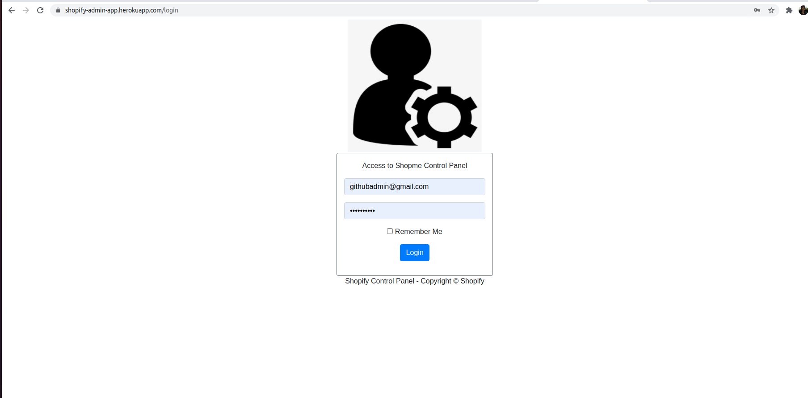

# Shopify 

## Overview
   Shopify is a complete Java Spring Boot Web application for an online e-shop.
   The app is used by employees and customers.
   The app itself consists of two sub-maven modules(projects) 
<!---ADD LINK TO ROLES-->
1. ShopifyBackEnd Project - used by the company employees with their various Roles.
2. ShopifyFrontEnd Project - used by customers(and visitors) of the shop's website.
   
### ShopifyBackEnd Project- Main Features:
- Authentication and Authorization.
- Manage Employees and Customers Accounts
- Manage Products
- Manage Brands
- Manage Categories
- Manage Brands
- Manage settings
- Manage Orders

### ShopifyFrontEndProject- Main Features:
- Authentication and Authorization.
- Managing their accounts.
- Make a payment via PayPal, Credit Card or Cash.
- Tracking their orders.	
  
	
## Quick Start: How to access the 2 deployed apps on Heroku cloud platrform?

### Access to the ShopifyFrontEndProject - Instructions

   Open the home page By clicking on the following link: [ShopifyFrontEnd Home Page ](https://shopify100.com) \
   Yod will see the following page:
   </br>
   </br>

   <center>
   
   </center>

   </br>
   <br/>
   At this point, you are a "visitor".
   You can login to the app as an existed customer by clicking on the "login" link on the top right corner of the home page.
   You will see the the login page: 

   <br/>
   <br/>

   <center>
            
    </center>

   <br/>
   <br/>     

   Use the following Credentials to login: 
   <br/>


                                            |     Username             |   Password      |  
                                            |--------------------------|-----------------|
                                            |`githubcustomer@gmail.com`|  `github2021`   |
         
      
  <br/>       
   
Alternatively - If you are not a registered customer - you can still login by using your own Google or Facebook accounts from the login page.

<br/>

<br/> 
 <b>Congradiulations!</b> You are logged in succesfully to the shopify-front-end applicatoin: You will see the home page with your user name on the top left corner:

<br/>
<br/>
   
   <center>
   
   </center>

<br/>
<br/>

### Access to the ShopifyBackEndProject - Instructions

   Open the login page By clicking on the following link: [ShopifyBackEnd Login Page ](https://admin.shopify100.com) \
   Yod will see the following page: 
   </br>
   </br>

   <center>
   
   </center>
  

   </br>
   <br/>
   Use Must have credentials of some Role(Admin, Saleperson,Editor, Shipper , Assistance) in order to access the application. 
   <br/>
   Use the following Credentials to login as an admin user in order to get full controll:
   <br/>
   <br/>  

                                           |     Username          | Password   |     Role     |
                                           |-----------------------|------------|--------------|
                                           |`githubadmin@gmail.com`|`github2021`|  `Admin`     |

    
   <b>Congradiulations!</b> You are logged in succesfully to the ShopifyBackEnd applicatoin
    <br/>
      <b>NOTE:</b> This is the admin hompepage after clicking on the "products" link in order the view the ilst of all proudcts
      

   <br/>
   <br/>
  
   <center>
            
    </center>

   <br/>
   

   <br/>
   <br/>     

   
  

<!-- APPLICATION SCREENSHOTS -->
## Application screenshots

[](documents/images/app-ui/home.PNG)

**More [Screenshots](documents/SCREENSHOTS.md)**

## Details

- [Technology stack & other Open-source libraries](documents/TECHNOLOGY_STACK.MD)  
- [Technical Functionalities and To-Do](documents/TECHNICAL_FUNCTIONALITIES.MD)  
- [Getting Started](documents/GETTING_STARTED.MD)  
- [Architecture](documents/ARCHITECTURE.md) 
- [Installation](documents/INSTALLATION.MD)  
- [Deployment](documents/DEPLOYMENT.md)  
- [Security](documents/API.md)  
- [Testing API](documents/TESTING.MD)  
- [Changelog](documents/CHANGELOG.md) 
- [Code Coverage](documents/CODE_COVERAGE.MD) 
- [Documentation](documents/DOCUMENTATION.MD) 

## Reporting Issues/Suggest Improvements

This Project uses GitHub's integrated issue tracking system to record bugs and feature requests. If you want to raise an issue, please follow the recommendations below:

* 	Before you log a bug, please [search the issue tracker](https://github.com/AnanthaRajuC/Spring-Boot-Application-Template/search?type=Issues) to see if someone has already reported the problem.
* 	If the issue doesn't already exist, [create a new issue](https://github.com/AnanthaRajuC/Spring-Boot-Application-Template/issues/new)
* 	Please provide as much information as possible with the issue report.
* 	If you need to paste code, or include a stack trace use Markdown +++```+++ escapes before and after your text.

<!-- CONTRIBUTING -->
## Contributing

Contributions are what make the open source community such an amazing place to be learn, inspire, and create. Any contributions you make are **greatly appreciated**.

Kindly refer to [CONTRIBUTING.md](/CONTRIBUTING.md) for important **Pull Request Process** details

1. In the top-right corner of this page, click **Fork**.

2. Clone a copy of your fork on your local, replacing *YOUR-USERNAME* with your Github username.

   `git clone https://github.com/YOUR-USERNAME/Spring-Boot-Application-Template.git`

3. **Create a branch**: 

   `git checkout -b <my-new-feature-or-fix>`

4. **Make necessary changes and commit those changes**:

   `git add .`

   `git commit -m "new feature or fix"`

5. **Push changes**, replacing `<add-your-branch-name>` with the name of the branch you created earlier at step #3. :

   `git push origin <add-your-branch-name>`

6. Submit your changes for review. Go to your repository on GitHub, you'll see a **Compare & pull request** button. Click on that button. Now submit the pull request.

That's it! Soon I'll be merging your changes into the master branch of this project. You will get a notification email once the changes have been merged. Thank you for your contribution.

Kindly follow [Conventional Commits](https://www.conventionalcommits.org/en/v1.0.0/) to create an explicit commit history. Kindly prefix the commit message with one of the following type's.

**build**   : Changes that affect the build system or external dependencies (example scopes: gulp, broccoli, npm)  
**ci**      : Changes to our CI configuration files and scripts (example scopes: Travis, Circle, BrowserStack, SauceLabs)  
**docs**    : Documentation only changes  
**feat**    : A new feature  
**fix**     : A bug fix  
**perf**    : A code change that improves performance  
**refactor**: A code change that neither fixes a bug nor adds a feature  
**style**   : Changes that do not affect the meaning of the code (white-space, formatting, missing semi-colons, etc)  
**test**    : Adding missing tests or correcting existing tests  

## License

Distributed under the MIT License. See [LICENSE.md](/LICENSE.md) for more information.

## FOSSA third-party code, license compliance and vulnerabilities

[](https://app.fossa.io/projects/git%2Bgithub.com%2FSpring-Boot-Framework%2FSpring-Boot-Application-Template?ref=badge_large)

## The End

In the end, I hope you enjoyed the application and find it useful, as I did when I was developing it to create a Spring Boot web application template with good/convenient practices for rapid prototyping. 

If you would like to enhance, please: 

* 	**Open PRs**, 
* 	Give **feedback**, 
* 	Add **new suggestions**, and
*	Finally, give it a 🌟.

* Happy Coding ...* 🙂

<!-- CONTACT -->
## Contact

Anantha Raju C - [@anantharajuc](https://twitter.com/anantharajuc) - arcswdev@gmail.com

Project Link: [https://github.com/Spring-Boot-Framework/Spring-Boot-Application-Template](https://github.com/Spring-Boot-Framework/Spring-Boot-Application-Template)

